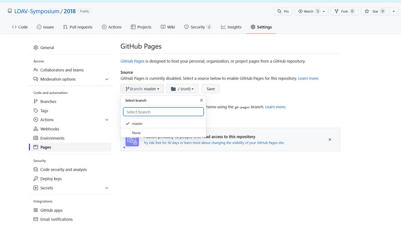

# LDAV Web Instructions

This archive (and this readme file in particular) provides suggested
instructions for maintaining and updating the LDAV Symposium web pages. The
LDAV web pages are currently being hosted by GitHub pages, so modifying web
pages is done by updating files in the respective GitHub repositories.

Starting with the initial preparations for LDAV, beginning soon after the
previous year's symposium, the general procedure is as follows.

  1. [Create a new web page](#create-a-new-web-page)
  2. [Rotate in new page](#rotate-in-new-page)
  3. [Update page](#update-page)


## Create a new web page

To minimize the down time of the LDAV web pages, it is best practice to
create the web pages for a new year offline.

### Getting started

You are free to create the web page in whatever way you like, but using a
previous year's web page is probably the easiest way to start. Do not worry
about preserving the git history of the previous year. In fact, it is
better to start with a fresh git repository to save space. The git history
of previous web pages will be saved [when we rotate out the old
page](#rotate-in-new-page).

Also, when creating a new web page, do not worry about including the web
content from previous years. Again, this content will be archived [when we
rotate in the new page](#rotate-in-new-page).

### A brief primer to Jekyll

Many of the LDAV web pages were created with the [Jekyll] web page builder
tool. Here is a quick primer on how to get started with [Jekyll] if you
have not used it before.

Jekyll uses ruby, so first you need ruby installed on your system. Ruby
might already be installed on your system, but you might need a newer
version in order to be able to download the necessary packages. Generally,
you can use a package manager do the dirty work.

Next, if you don't have the `bundle` executable on your system, you need to
install bundler, which is done through the `gem` installer part of ruby.

``` sh
sudo gem install bundler
```

Once bundler is installed you can finally install Jekyll.

``` sh
sudo gem install jekyll
```

Typically, the first thing you need to do when you want to build a specific
repository is to make sure that you have all the packages and plugins
necessary. To update jupyter on local machine, be in this repositories root
directory and run:

``` sh
bundle install
```

You probably need to run this with root permissions (i.e. `sudo`).

Once you have done this, you should be able to run the Jekyll server, which
will build the html pages and start a simple web server.

``` sh
bundle exec jekyll serve
```

When you run the server, [Jekyll] will build the web pages in the `_site`
directory and start a lightweight web service that you can connect to with
your web browser.


## Rotate in new page

Once the new web page is complete, it is time to rotate in the new page by
moving the existing page to an archive directory and replacing the main
page.

### Move existing front page to archive

The first step is to move the existing page to an archive page. To do this,
go to the [LDAV web GitHub
page](https://github.com/LDAV-Symposium/LDAV-Symposium.github.io) and click
on the `Settings` tab.


In the settings, change the `Repository name` to the year the repository
represents. For example, if the current LDAV page documents the symposium
for the year 2019, then change the repository name to `2019`.


Once the page is renamed, go back to the `Settings` tab. Scroll down to the
section labeled `GitHub Pages`. The first option for the GitHub pages is
the `Source`. The `Source` is probably set to `None`. Change it to `Master
Branch`.



### Create new front page

Once the last front page has been moved out of the way, a new front page
can be installed. To do this, first create a new repository named
`LDAV-Symposium.github.io` in the LDAV-Symposium GitHub organization. Note
that the name of the repository is very important. The web page will not
work if it is not named exactly `LDAV-Symposium.github.io`.

Once the repository is created, push this year's web page to that
repository. GitHub provides instructions on how to do this.

### Check links

Once the rotation is complete, go to [ldav.org] and double-check all of the
web links. When the main page was moved to the archive, the relative
position of many pages changed, so make sure they are all still active.
Also, make sure the links of the new page are correct (including links to
last year's page and all other archive pages).


## Update page

Throughout the year, there will be a need to continually update the main
page. The web page is easily updated by changing files in the `master`
branch and pushing them to `GitHub`.

GitHub also provides pull requests, which are a convenient mechanism for
excepting external contributions. If a collaborator wishes to contribute a
change to the LDAV web pages, have him or her fork the repository, make a
local change, and start a pull request.


## Contacts

Here is a list of some contacts for some administrative access to various
parts of the LDAV web page maintenance. Note that as roles change, it is
possible that some of these contacts can become out of date.

##### GitHub Projects

You can contact [Kenneth Moreland] or [Christoph Garth] for help with the
[LDAV-Symposium] "organization" on GitHub, under which all LDAV web page
respositories are hosted. They can help add members to the organization,
add new projects, and modify access.

##### DNS Hosting

DNS hosting is managed by the University of Utah's SCI institute. [Nathan
Galli] is the contact there for making changes to how DNS redirects
ldav.org to where the pages are hosted.


[Christoph Garth]: mailto:garth@cs.uni-kl.de
[Kenneth Moreland]: mailto:kmorel@sandia.gov
[Nathan Galli]: mailto:nathang@sci.utah.edu


[Jekyll]: https://jekyllrb.com/
[ldav.org]: http://ldav.org/
[LDAV-Symposium]: https://github.com/LDAV-Symposium
